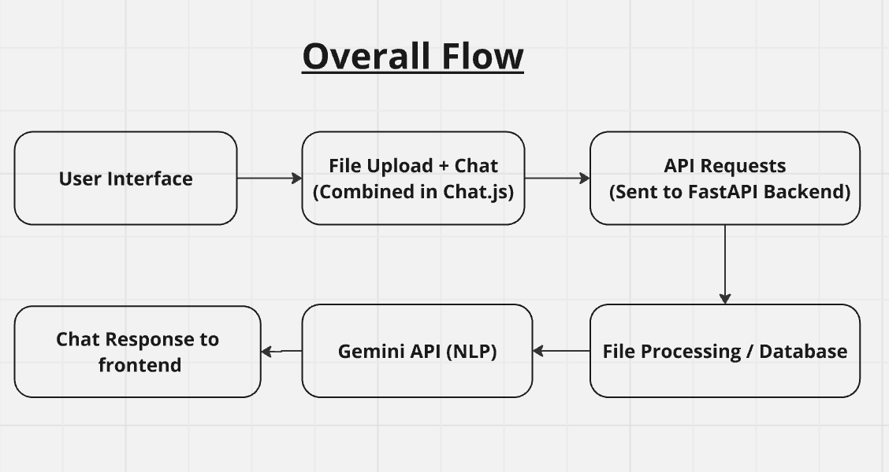

# Frontend: Gemini PDF ChatBot

## Overview
This frontend serves as the user interface for the Gemini PDF ChatBot. It allows users to upload documents and interact with the chatbot on the same page, providing a seamless experience.


## Installation

1. **Clone the repository:**
   ```bash
   git clone https://github.com/sanskarpan/Gemini-PDF-ChatBot-Frontend.git
   ```
2. **Install dependencies:**
    ```bash
    npm i
    ```

3. **Run the frontend:**
    ```bash
    npm start
    ```
    This will start the React development server. By default, the app runs on http://localhost:3000/.

## Features
* **Document Upload**: Users can upload PDF or DOCX files through a dropdown interface at the top of the page.
* **Chat Interface**: Once a document is uploaded, the dropdown closes, and the chat interface is revealed. Users can ask questions, and the chatbot will respond based on both the document's content and the data retrieved from the database.
* **Seamless User Experience**: The frontend offers a smooth transition from document upload to chat interaction on the same page.

## Technologies Used
* **React**: For building the user interface.
* **CSS**: For styling the application.
* **Axios**: For making API requests to the backend.

### More
You can learn more about this project from  overall documentation.

### Overall Flow
